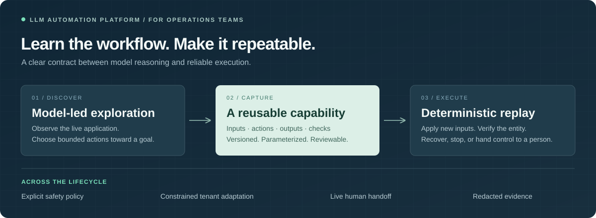
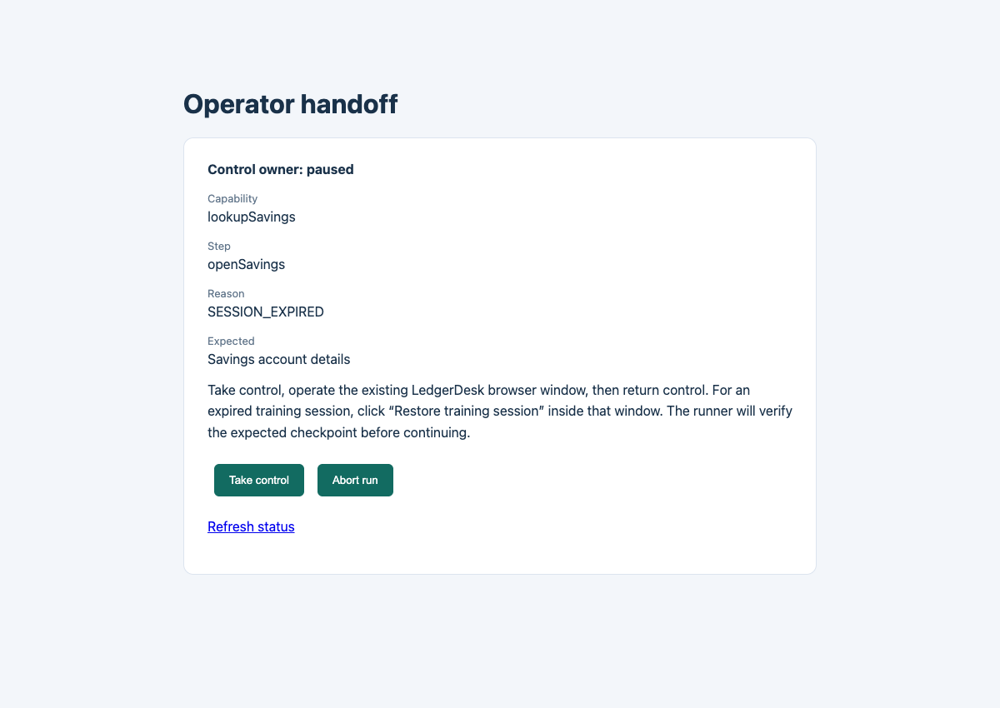

# LLM Automation Platform for Operations Teams

**Turn repetitive work in legacy software into reusable, verifiable automation.**

**[Try the interactive demo](https://llm-automation-operations-demo.tina219127.chatgpt.site)** · [Real browser screenshots](docs/DEMO.md) · [Architecture](REPORT.md) · [Run the demo](docs/RUNNING.md) · [Design decisions](docs/DECISIONS.md) · [Evidence](evidence/assurance/SUMMARY.md)



## See it working

**[Launch the interactive workflow studio →](https://llm-automation-operations-demo.tina219127.chatgpt.site)** Try sample runs, failure conditions, and human handoff without an API key. The public app is an explicitly labeled simulation; live AI discovery shows “API token unavailable.”

[](docs/DEMO.md)

**[Open the two-minute walkthrough →](docs/DEMO.md)** Real browser captures show lookup, tenant reuse, wrong-member rejection, and same-session handoff. No installation needed. Synthetic data and an authored replay capability; live LLM discovery evidence remains pending.

## About

Operations teams spend time repeating tasks across legacy applications that lack usable APIs. They need automation whose results they can verify and whose exceptions they can resolve. This platform is designed for those teams, with automation engineers configuring workflows and operators handling exceptions.

**Product insight:** discovering a workflow and executing it repeatedly are different jobs. Use an LLM to discover the steps, capture a reviewable capability, then replay it with explicit identity and result checks. When execution cannot proceed safely, a person takes over the same live session.

The current prototype provides developer tools and an operator handoff console, demonstrated through a synthetic banking workflow.

## How it works

| Discover                                                                    | Capture                                                                                    | Execute                                                                                            |
| --------------------------------------------------------------------------- | ------------------------------------------------------------------------------------------ | -------------------------------------------------------------------------------------------------- |
| An LLM observes a live interface and chooses bounded actions toward a goal. | The successful flow becomes a versioned, parameterized capability that people can inspect. | A deterministic runtime applies new inputs, verifies the result, and returns a structured outcome. |

Safety policy surrounds both discovery and execution. When automation cannot proceed safely, it pauses and gives a person control of **the same live session**, then checks the state before continuing.

## Three questions shape the design

### Is it the right result—or just the right screen?

A valid savings page can still belong to the wrong member. Before reading a balance, the platform checks that the displayed identity matches the requested one. A successful click is only part of the evidence.

### Can one workflow serve more than one institution?

The same capability runs across two tenant presentations. A constrained adapter handles different labels and frames while preserving permissions, output definitions, and identity checks. Unrecognized differences stop execution for review.

### What happens when the happy path ends?

“Member not found,” a temporary service error, and a session expiry need different responses. The runtime distinguishes business outcomes, bounded recovery, and human intervention—and records enough redacted evidence to explain its decision.

## The platform in miniature

The working example searches a synthetic banking system, opens a member's savings account, and returns the balance and currency. A second presentation, Harbor CU, exercises reuse across institutions.

**TypeScript runtime + Python API connectors · 15 fault-corpus cases · 2 tenant presentations · 0 model calls during replay**

The [assurance lab](evidence/assurance/SUMMARY.md) includes a revealing counterexample: the expected page is visible, but the member is wrong. Both presentations reject it before extraction. These are reproducible synthetic experiments, not a production reliability claim.

> **Current stage:** The runtime, tenant reuse, and handoff mechanism are implemented and tested. Genuine API-backed discovery evidence is still pending; published offline runs use an explicitly authored capability.

## Explore further

- **[Design report](REPORT.md)** — architecture, contracts, safety, and deliberate scope.
- **[Decision notes](docs/DECISIONS.md)** — alternatives considered and where the guarantees end.
- **[Python integration](docs/PYTHON.md)** — model API connectors and the runtime boundary.
- **[Running guide](docs/RUNNING.md)** — setup, live discovery, replay, and human handoff.
- **[Reviewer guide](docs/REVIEW.md)** — assignment coverage and implementation map.

<details>
<summary><strong>Quick start — setup, discover, replay</strong></summary>

Requires Node.js 22.9+, Google Chrome, and Python 3.10+ for live discovery. Copy `.env.example` to `.env` and configure the provider's API key and `LLM_MODEL` for live discovery. See the [running guide](docs/RUNNING.md) for Chromium and provider alternatives.

```bash
npm ci
cp .env.example .env
npm run demo:assurance # No API key needed; uses an authored fixture.

# For live discovery, start the sandbox in another terminal:
npm run app

# Then discover a capability and replay it with a different input:
npm run discover -- --inputs '{"memberId":"12345"}' --evidence evidence/live
npm run replay -- --inputs '{"memberId":"67890"}' --evidence evidence/live
```

The default goal reads the supplied member's savings balance and currency. Discovery saves `artifacts/lookup-savings.json`; replay loads that same artifact. Keep keys in your local `.env`.

</details>
