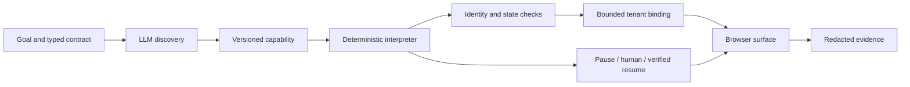

# Capability Runner

An LLM discovers a UI workflow once. A typed capability records that workflow. A deterministic executor replays it with new inputs, handles known outcomes, and transfers a live session to a human when required.

**Status:** The local implementation and offline browser demonstration are available. A genuine API-backed discovery run and replay of its resulting artifact are still required before submission. Offline fixtures are explicitly labeled and are not evidence of LLM discovery.

## Three design decisions worth examining

### 1. A correct screen can contain the wrong account

A heading-only checkpoint can silently accept another member's balance. Each capability carries an input-bound identity postcondition, checked inside the browser before extraction and again before success. The model never sees the identifier. The fault corpus includes a normal-looking account page containing the wrong member, and verifies that extraction is blocked.

### 2. Reuse the workflow; constrain the tenant differences

The **same unchanged capability** runs on LedgerDesk and the Harbor CU presentation. A small overlay can rename controls, frames, and the application fingerprint. It cannot add routes or permissions, change outputs, remove identity checks, or alter recovery behavior. Base-profile drift, locator collisions, and rebinding to known risky controls fail closed. This is a concrete implementation of cross-tenant reuse with an intentionally narrow compatibility boundary.

### 3. Make the claims reproducible

The [Capability Assurance Lab](evidence/assurance/SUMMARY.md) verifies **15 expected behaviors**, including counterexamples, with **zero model calls during replay**. It links each row to actual browser evidence and binds results to the capability's content hash. These are synthetic test results, not a production reliability percentage or a substitute for real discovery.



## What the demo does

LedgerDesk is a local banking sandbox with synthetic records, server-rendered pages, an iframe, and table-based account views. The flow is member search → member detail → savings account → typed balance and currency. There are no test IDs. Automation interacts with the rendered UI; it never calls a banking data API.

The app profile defines an unordered inventory of reviewed controls, permitted actions, and error detectors. It does **not** specify the workflow. During discovery, the model chooses each next action from controls actually visible in the live browser. During replay, the runner imports no model client.

## Setup

Requires Node.js 22.9+ and either Google Chrome or Playwright Chromium.

```bash
npm ci
cp .env.example .env
```

The example configuration uses installed Chrome (`BROWSER_CHANNEL=chrome`). If Chrome is unavailable:

```bash
npx playwright install chromium
```

Then leave `BROWSER_CHANNEL` empty in `.env`. On Linux CI, use `npx playwright install --with-deps chromium`.

For live discovery, edit `.env` locally:

```dotenv
LLM_PROVIDER=openai
LLM_MODEL=YOUR_ENABLED_MODEL_ID
OPENAI_API_KEY=YOUR_LOCAL_KEY
BROWSER_CHANNEL=chrome
```

Supported adapters: `openai` (Responses API), `anthropic` (Messages API; use `ANTHROPIC_API_KEY`), and `compatible` (Chat Completions; set `LLM_BASE_URL` and `OPENAI_API_KEY`). Select a model supporting JSON decisions. Provider adapters remain unverified against a live account until real evidence is generated. Never put keys in commands, the repository, goals, or screenshots.

## Run without live services

```bash
npm run typecheck
npm test
npm run demo:offline
npm run demo:assurance
```

The offline demo starts its own sandbox on a temporary loopback port. It replays an **authored fixture**, including changed input, not-found, transient error, permission denial, and session-expiry cases. Logs and sanitized failure snapshots go into `evidence/offline/`. No API key is needed. Browser tests also exercise the discovery recorder using an explicitly labeled test double, and simulate an operator on the same live page.

The assurance lab also starts its own sandbox. It tests normal results, rejected states, recovery budgets, and cross-tenant bindings. Inspect `evidence/assurance/SUMMARY.md` and `index.json`. Assess a genuinely discovered artifact with `npm run demo:assurance -- --artifact artifacts/lookup-savings.json`.

## Real discovery and deterministic replay

Terminal 1:

```bash
npm run app
```

Terminal 2, after configuring `.env`:

```bash
npm run discover -- \
  --goal "Look up the supplied member and read their available savings balance and currency." \
  --target http://127.0.0.1:4173 \
  --inputs '{"memberId":"12345"}' \
  --artifact artifacts/lookup-savings.json \
  --evidence evidence/live \
  --headed

npm run replay -- \
  --artifact artifacts/lookup-savings.json \
  --inputs '{"memberId":"67890"}' \
  --evidence evidence/live

npm run replay -- \
  --artifact artifacts/lookup-savings.json \
  --inputs '{"memberId":"99999"}' \
  --evidence evidence/live
```

`--target` selects the deployment origin; the reviewed entry route comes from the profile. The default profile is `config/demo-profile.json` and the input/output contract is `config/lookup-contract.json`. Each run uses a fresh browser context. Discovery has a 24-decision and 120-second loop budget; an in-flight request can take up to 30 seconds. A capability is emitted only after verifying the final checkpoint and every declared output.

The programmatic runner returns real typed outputs in memory. The CLI and saved evidence redact sensitive outputs by default. `--show-outputs` opts into printing **synthetic demo** outputs to the terminal; do not use that option with real customer data. All examples use synthetic identifiers, so shell history is safe for these examples.

## One capability, two tenant presentations

After running `npm run demo:offline` and starting `npm run app`:

```bash
npm run replay -- \
  --artifact evidence/offline/authored-artifact.json \
  --inputs '{"memberId":"67890"}' \
  --tenant config/tenants/harbor.json \
  --headed
```

For live artifacts, change only `--artifact` to the discovery output. The overlay's ID selects the synthetic tenant through a sandbox-only cookie; real deployments would use separate tenant origins and isolated sessions. For visual comparison, open [LedgerDesk](http://127.0.0.1:4173/preview/base) and [Harbor CU](http://127.0.0.1:4173/preview/harbor). The manual preview routes are not in the automation allowlist.

Inspect [the overlay](config/tenants/harbor.json) and [the compatibility boundary](src/tenant.ts). Label mappings are trusted configuration requiring semantic review: restricting an overlay's structure cannot prove that a renamed control has the intended business meaning. A hash detects mismatches; it is not an approval signature.

## Live human handoff

Start the app, then run either a discovered artifact or the offline fixture:

```bash
npm run replay -- \
  --artifact evidence/offline/authored-artifact.json \
  --inputs '{"memberId":"12345"}' \
  --scenario expired --human
```

1. The runner opens a headed browser and pauses at the expired session.
2. Open the loopback operator-console URL printed in the terminal.
3. Click **Take control**. Use the existing LedgerDesk window, not a new banking session.
4. Click **Restore training session** in LedgerDesk. Wait for the account details.
5. Click **Return control** in the console. The runner verifies the recorded checkpoint, extracts outputs, and completes.

The restoration button simulates authentication; it is not a real identity system. Ownership transfer, paused execution, same-session operation, auditing, and resume validation are real. The console is available only for the run and uses an unguessable per-run token. It times out after five minutes. `--human` implies a headed browser. Without this flag, the runner emits an intervention request and returns `INTERVENTION_REQUIRED` instead of waiting indefinitely.

## Results and fault scenarios

| Scenario / input         | Result                                                          |
| ------------------------ | --------------------------------------------------------------- |
| `normal`, member `12345` | Success: 4250.75 USD (redacted in logs)                         |
| `normal`, member `67890` | Success: 812.30 USD                                             |
| `normal`, member `99999` | Business outcome: `MEMBER_NOT_FOUND`                            |
| `normal`, member `abc`   | Business outcome: `INVALID_MEMBER_ID`                           |
| `transient`              | One known retry, then success                                   |
| `persistent`             | Failure: `RECOVERY_EXHAUSTED` after two retries                 |
| `denied`                 | Failure: `PERMISSION_DENIED`                                    |
| `expired`                | Human restoration or `INTERVENTION_REQUIRED`                    |
| `unexpected`             | Checkpoint timeout and intervention                             |
| `wrong-member`           | Correct page, wrong entity: `ENTITY_MISMATCH` before extraction |
| `malformed-output`       | Failure: `OUTPUT_PARSE_FAILED`                                  |
| `ambiguous`              | Failure: `AMBIGUOUS_TARGET`; no first-match fallback            |

Pass scenarios with `--scenario NAME`. They are synthetic fault injection through an isolated context cookie, not model-selected actions. Failures return step, expected state, observed control inventory, and a sanitized DOM diagnostic. Exit code 0 covers success and known business outcomes; failure exits 1.

## Project map

```text
src/schema.ts       Typed artifacts, actions, contracts, and result types
src/profile.ts      Reviewed app adapter configuration and policy
src/tenant.ts       Presentation-only tenant overlays and binding validation
src/surface.ts      Browser adapter, network boundaries, private observations
src/planner.ts      API-backed next-action decisions
src/engine.ts       Discovery recorder and deterministic replay
src/handoff.ts      Session ownership and local operator console
src/evidence.ts     Structured redacted evidence
src/demo-app.ts     Synthetic legacy-style banking sandbox
tests/             Contract, policy, browser, and handoff tests
scripts/assurance-lab.ts  Reproducible cross-tenant fault corpus
evidence/          Explicitly labeled execution evidence
REPORT.md          Design decisions and deliberate cuts
```

## Before submitting

### Assignment coverage

| Requirement                               | Implementation / evidence                                                                | Status                                                                           |
| ----------------------------------------- | ---------------------------------------------------------------------------------------- | -------------------------------------------------------------------------------- |
| 3.1 Goal-driven agent loop                | `src/engine.ts`, `src/planner.ts`; live observations and bounded typed decisions         | Implemented; real API run pending                                                |
| 3.2 Structured capability                 | `src/schema.ts`; versioned inputs, outputs, targets, actions, checkpoints and provenance | Implemented                                                                      |
| 3.3 Deterministic replay                  | `src/engine.ts`; identity assertions, browser tests and assurance corpus                 | Verified with authored fixture                                                   |
| 3.4 Safety and policy                     | `src/profile.ts`, `src/surface.ts`, `src/evidence.ts`                                    | Tested on synthetic data                                                         |
| 3.5 Evidence and observability            | Structured events, redacted results and sanitized DOM diagnostics                        | Offline evidence present; live evidence pending                                  |
| 3.6 Human escalation and handoff          | `src/handoff.ts`; same-page ownership transfer and verified resume                       | Tested with simulated operator; real walkthrough recommended                     |
| 3.7 Heterogeneity and multi-tenant design | `REPORT.md`, `ManagedSurface`, `src/tenant.ts`                                           | Two presentations reuse one artifact; desktop and tenancy infrastructure omitted |

GitHub Actions runs type checking and browser tests without model credentials. Passing CI does not establish submission readiness: the workflow separately reports whether real discovery and its linked replay evidence exist.

Current artifacts use **schema 1.1**, which requires identity postconditions. Historical schema 1.0 evidence is preserved under `evidence/archive/v1.0/`; those artifacts are intentionally rejected by the current interpreter. Regenerate the offline fixture or re-record discovery instead of silently upgrading a capability that lacks the required safety contract.

Run `npm run check:submission` after generating real discovery and replay evidence. It intentionally fails while only offline fixtures exist. Review `evidence/` for sensitive content, rerun tests, and publish the source to a public repository. Submission instructions from the assignment require the repository URL by email; this project does not send that email automatically.

## Reference documentation

- [Playwright locators](https://playwright.dev/docs/locators): scoped roles and labels, exact matches, and auto-waiting.
- [OpenAI structured output formats](https://developers.openai.com/api/docs/guides/structured-outputs): JSON response configuration. The runner additionally validates decisions with Zod.
- [Claude authentication](https://platform.claude.com/docs/en/manage-claude/authentication): API key headers for the Messages adapter.
