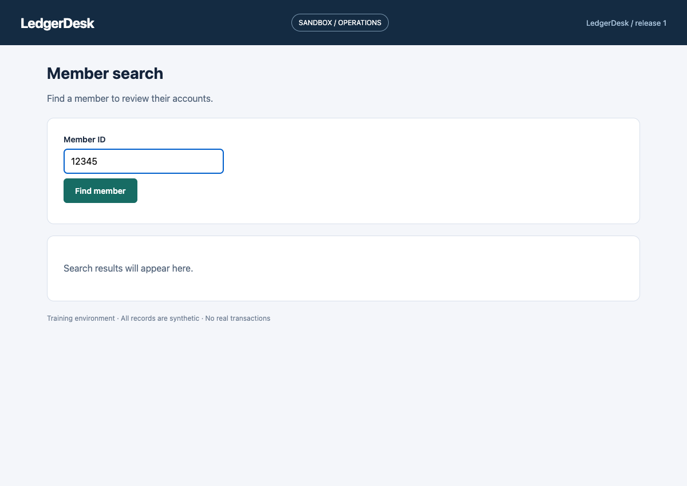
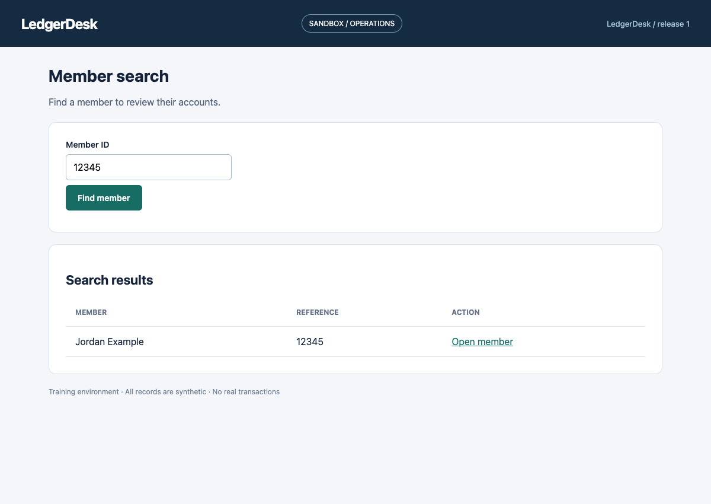
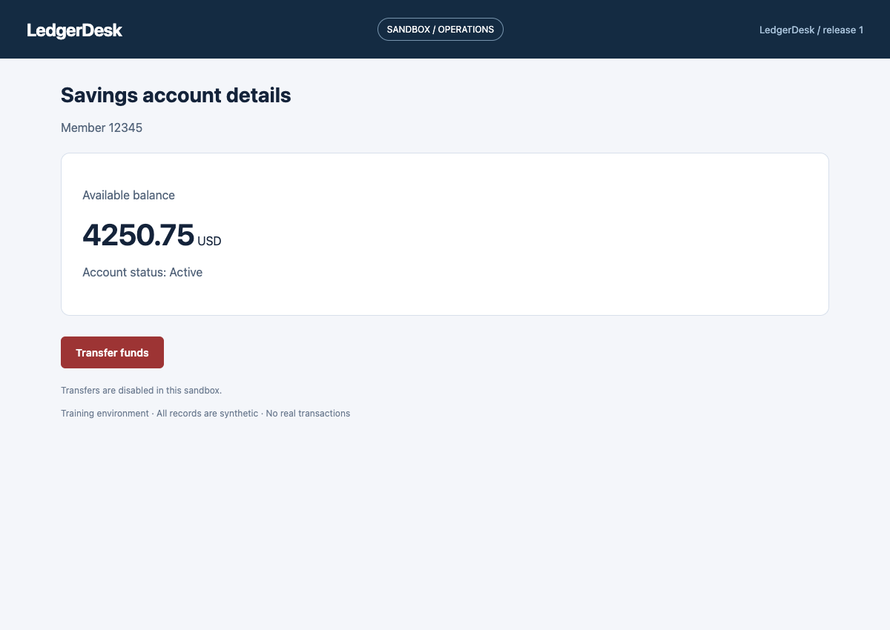
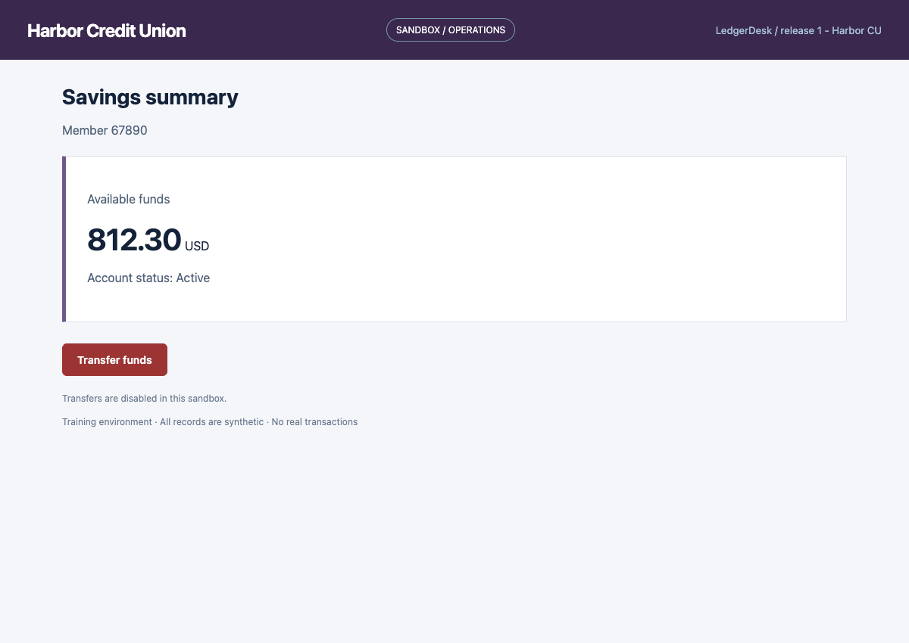
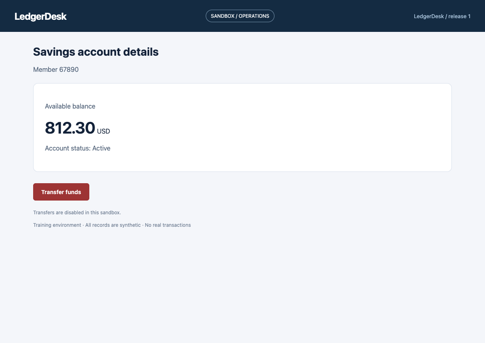
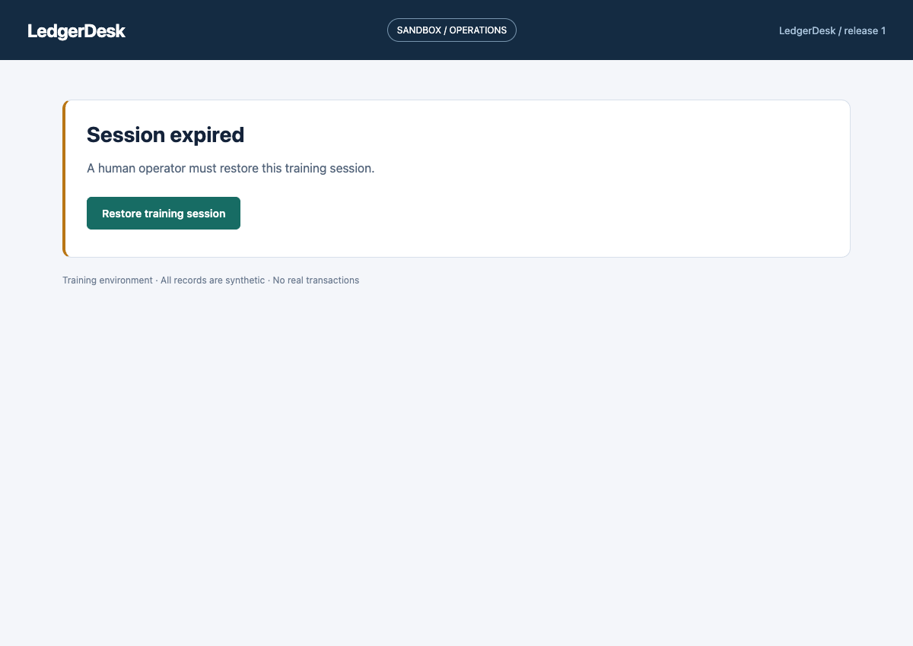

# See the platform in action

**[Try the interactive demo](https://irenezhangtt.github.io/llm-automation-platform/)** · No API key needed

The public workflow studio is a browser-side simulation. The screenshots below separately document execution of the real Playwright runtime.

**A two-minute interview walkthrough · No installation required**

[Project overview](../README.md) · [Architecture](../REPORT.md) · [Run it locally](RUNNING.md) · [Execution evidence](../evidence/assurance/SUMMARY.md)

These are actual browser screenshots captured while the automation ran against LedgerDesk, the project's synthetic banking application. They show the application being automated and the platform's operator console. All names, identifiers, and balances are synthetic.

**Demo scope:** deterministic execution of the capability generated by the [genuine Claude discovery run](../evidence/live/README.md). The human handoff is exercised by a scripted operator on the same live page. These screenshots show replay and handoff; the linked discovery logs separately document the real model calls.

## 1. Give the workflow a new input

An operations employee needs a member's savings balance. The runner binds the supplied member ID to the workflow's declared input and fills the application's search form.



## 2. Navigate the existing interface

The runner finds the member, opens their profile, then opens the savings account. It uses reviewed controls inside the application's iframe, rather than a hidden data API.



## 3. Verify the entity before returning the result

The screen displays a balance of **4,250.75 USD**. Before extracting it, the runtime verifies that the displayed member reference matches the requested ID. The capture run completed successfully.



**Why it matters:** reaching the expected screen alone is not proof that the task succeeded.

## 4. Reuse the same capability at another institution

Harbor Credit Union uses different labels, branding, and an iframe title. A reviewed presentation adapter lets the same capability look up a different synthetic member and return **812.30 USD**. The underlying workflow artifact is unchanged.



## 5. Reject a plausible but incorrect result

This run requested member **12345**, but the application displayed **67890** on an otherwise valid savings screen. The runtime returned **ENTITY_MISMATCH** before extracting the balance. The screenshot deliberately shows the misleading application state; the rejection comes from the runtime, not from a fabricated UI banner.



**Interview discussion:** what should count as success in an automation system—a sequence of clicks, or a verified business result?

## 6. Pause and ask an operator to intervene

An expired session interrupts the workflow. Automation stops and preserves the live browser session.



The platform's actual operator console shows the capability, blocked step, reason, expected screen, and control ownership. The operator can take control or abort.


The capture script simulates taking control, restoring the training session, and returning control. The runtime verifies the restored state and completes the lookup on the same browser page.


## What was checked?

| Capture scenario  | Observed outcome                                 | Model calls during replay |
| ----------------- | ------------------------------------------------ | ------------------------- |
| LedgerDesk lookup | Success                                          | 0                         |
| Harbor CU lookup  | Success, same capability hash                    | 0                         |
| Wrong member      | ENTITY_MISMATCH                                  | 0                         |
| Session expiry    | Paused → scripted operator restoration → success | 0                         |

[Capture manifest](assets/demo/capture-manifest.json) records the scenario outcomes, run IDs, artifact hash, and capture time. The broader [15-case assurance corpus](../evidence/assurance/SUMMARY.md) covers recovery, permissions, malformed outputs, and tenant binding failures.

## Reproduce the screenshots

With dependencies and a browser installed, run:

```bash
npm run demo:capture -- --artifact artifacts/lookup-savings.json --evidence evidence/live/walkthrough
```

This starts a temporary local sandbox, runs the real interpreter, asserts the outcomes, and writes the screenshots to `docs/assets/demo/`. Detailed run logs are saved under `evidence/live/walkthrough/`. Omitting the flags instead captures an authored fixture and writes logs to ignored `runs/presentation/`. It needs no model key and never connects to a real banking system.
